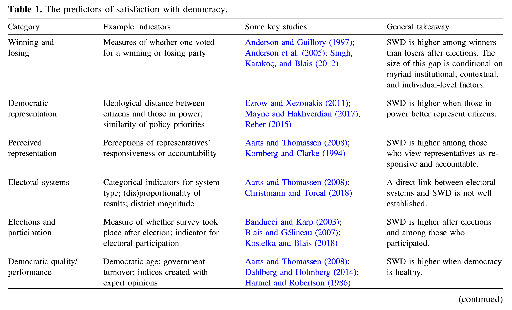
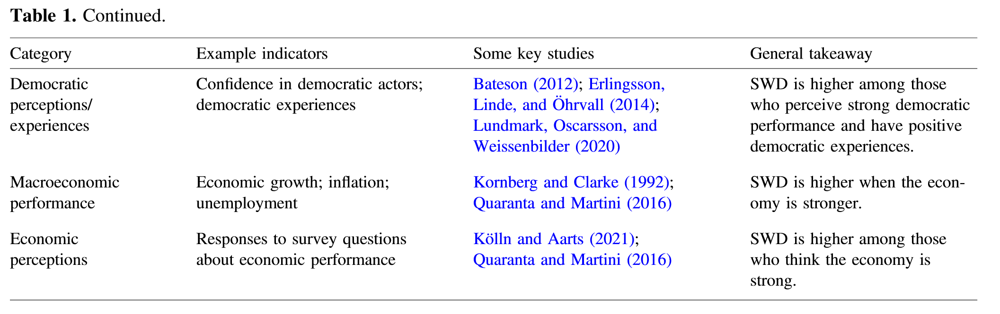

```{=tex}
\pagenumbering{arabic}
\setcounter{page}{4}
\renewcommand*{\thepage}{A\arabic{page}}
```

# Prominent Works on Political Discontent/Dissatisfaction
## 1) Discussions on "Critical Citizens"

-- Critical citizens (@norris1999critical)

- In the United States, public support for institutions (day-to-day operations of government) had dropped significantly from 1960s to 1990s. However, the support for the underlying constitutional framework – democracy – remained robust. The phenomenon is not just American, but a global trend.

- Declining confidence in government could be a sign of health as democracy needs critical citizens. But there is still a concern of the declining confidence in government: loss of confidence can harden into cynicism and hatred; over a long run, may weaken support for democracy as a form of governance. The mechanism is that the well performance of government requires trustful citizens who 1) have voluntary compliance with the law, 2) have willingness to pay taxes, and 3) are eager to enter government services. Without these, government performance worsens, and citizens will become more disaffected and distrustful – it is a cumulative downward spiral that could erode democratic support over a long run.

-- @bertsou2019rethinking disagrees that political distrust is the “guardian of democracy”. Political distrust observed in established democracies should not be conflated with the thought of vigilant citizenry in the liberal democratic traditions (Madison, Hume, etc.). The "liberal distrust" does benefit democracy, but its emphasis of the need of vigilance is onlyb to justify an institutional design controlling power abuse. She argues that after democracy is established, what is needed for the system to function healthily is political trust.

Then, she argues that conflating “political distrust” with the “lack of political trust” is problematic. She defines political distrust as a relational attitude that reflects perceptions of untrustworthiness specific to the political system in its entirety or its components. It entails three evaluative components: 1) judgements of government’s capacity, 2) moral judgements, and 3) perceptions of incongruent interests between the citizen and the system or agents. 

-- @saikkonen2023guardians, using a conjoint experiment conducted in Finland, find that citizens with higher levels of political trust and democratic satisfaction are more likely to condemn democratic transgressions by politicians. They thus conclude that citizens with high political satisfaction rather than the “critical citizens” (who are disaffected) are the true guardians of democracy.

-- In general, studies, both theoretical and empirical, reject the need of "critical citizens" for a healthy functioning democracy (even Pippa himself is concerned with the hazard of disaffection to the democratic system). More pieces of empirical evidence (such as @Marien2011 and @Dalton2004 presented below) clearly show that distrustful and disaffected citizens compromise  effective governance and collobration.

## 2) Discussions on "Democratic Deficit"

-- Democratic Deficit (@norris2011democratic)

- Since the early 1990s, many scholars have diagnosed a rise in voter discontent, anger, and distrust in governments. This has been accompanied by phenomena such as declining voter turnout and weakened party loyalty, indicating a weakening link between citizens and the state. This book challenges challenges the conventional wisdom of declining political support in established democracies, arguing instead that declining political support should be understood as examining the gap between the desire for democracy (“How important is it for you to live in a country that is governed democratically?") and the evaluation of the functioning of democracy in practice (Democratic satisfaction - "how democratically is this country being governed today?"), known as 'democratic deficit.' 

- With the concept of democratic deficit, the book examines a world value survey from 90 countries from 1981 to 2007. It produces the following main findings.
    1. Contrary to the conventional wisdom of increasing political distrust in advanced democracies, the  analysis reveals diverse patterns across countries, with no consistent downward trend.
    2. Countries with longer democratic experiences tend to have higher levels of democratic support and satisfaction, but there are significant variations within each regime type. The desire for democracy itself is universally high, regardless of economic development levels which suggest that economic development does not increase the desire for democracy.
    3. Cultural factors such as education, self-expression values, social trust, and associational participation have a positive effect on democratic aspirations, but they do not exacerbate the deficit by negatively affecting satisfaction with democracy.
    4.The use of news media, including newspapers, television, and the Internet, has a positive effect on both democratic aspirations and satisfaction. The impact of negative news coverage and scandals is limited.
    5.The quality of democracy and governance, economic development, and subjective well-being contribute to higher satisfaction with democracy.
    6. Democratic deficit have a significant impact on political participation, law-abiding behavior, and democratization. In particular, democratic aspirations increase political interest, participation in legal protests, and voluntary tax compliance, which contributes to the consolidation of democracy.
    7. While the demand for democracy is nearly universal, the key to bridging the democratic deficit lies in improving the quality of democratic governance and its outcomes, so as to meet citizens' evolving expectations and aspirations.

-  @singh2023satisfaction provides the following table by reviewing 305 articles that utilize satisfaction with democracy (SWD) as an outcome variable. Three notable findings emerge. Firstly, numerous studies indicate that SWD tends to be higher among election winners compared to losers. Secondly, SWD tends to increase when political elites better represent their constituents, particularly when their ideologies align more closely with those of the public. Lastly, SWD tends to be higher among individuals who perceive their representatives as responsive and accountable.

{style="display: block; margin: 0 auto; width: 100%;"}
{style="display: block; margin: 0 auto; width: 100%;"}

- @van2020long analyzes the impact of citizens' perceived distance from their preferred policy party on their satisfaction with democracy using survey data from 31 European countries. Key findings are as follows:
    1. As the policy distance between citizens and their preferred party increases, satisfaction with democracy decreases. This effect was observed across both left-right ideological scales and European integration policy scales. But, the impact of distance on satisfaction with democracy was more pronounced in the left-right ideological scale.
    2. This "representation gap" effect was found to be significant regardless of the size or incumbency status of the preferred party. In other words, even small or opposition parties, if perceived as close to oneself, tend to contribute to democratic satisfaction.
    3. The results of this study suggest that not only participation in government and policy implementation by parties, but also their representation and advocacy of voter preferences, contribute to satisfaction with democracy.
  
- @heyne2019democratic develops a spatial model to explain satisfaction with democracy based on the idea that satisfaction is a product of the gap between what "should be" and what "is" - between democratic expectations and evaluations (the idea of democratic deficit). One of main contribution of this paper to the literature is that it finds that "over"supply also can produce the democratic disatisfaction. Using data from 26 European countries, the study finds that the size and direction of the gap between expectations and evaluations in different dimensions of democracy (liberal, social, direct) affect levels of satisfaction. The main finding suggests that liberal criteria of democratic quality are generally agreed upon, and a perceived lack of their realization is the strongest predictor of dissatisfaction. On the other hand, social and direct democracy dimensions are more disputed, creating dissatisfaction among those wanting more of them (less supply) as well as those wanting less (over supply).

- @dahlberg2014democracy tests the impact of various measures of electoral system design, ideological congruence between voters and representatives, and quality of government on citizens' satisfaction with democracy. The paper finds that the quality of government (output) matter more for citizens' evaluations of democratic performance than the representative features of democracy (input) in affecting citizens' satisfaction with democracy. Specifically, while electoral designs (proportional electoral system, number of effective parties and ideological congruence) is weakly or modestly, at best, related to the democratic satisfaction, the quality of government - measures of impartiality, professionalism, rule of law, and especially government effectiveness - are all positively related to satisfaction. The weak association between electoral system and democratic satisfaction is also mentioned in @singh2023satisfaction.

- @camacho2019understanding finds that democratic experience or economic development does not directly increase public support for democracy but changes the importance of evaluations of the government in providing economic or political benefits in supporting democracy. Specifically, citizens of new democracies tend to place more emphasis on economic performance when supporting democracy. In contrast, citizens of established democracies place more emphasis on political benefits—such as the protection of rights and freedoms, opportunities for deliberation and accountability, and effective representation—when supporting democracy.

- @norris2019perceptions examines the relationship between perceived electoral integrity and public satisfaction with democracy using 6th and 7th waves of World Value Survey. The main finding show that perceptions of electoral integrity and malpractice are significant predictors of democratic satisfaction, even after controlling for economic factors and voting for the winning party. Specific issues like the fairness of the vote count and media bias were seen as particularly important. The pocketbook economy was also associated with greater satisfaction, although the effects were usually weaker than for electoral integrity. Lastly, voting for the victorious party was linked with higher levels of democratic satisfaction, as the "winner-loser" thesis predicts. The paper concludes that public perceptions of electoral integrity are closely linked to broader evaluations of liberal democracy.

- @quaranta2016does investigates the relationship between economic performance and satisfaction with democracy in 28 European Union member states from 1973 to 2013. The analysis tests several economic indicators, including objective measures like public debt, unemployment, GDP growth, and inflation, as well as subjective evaluations captured by the Consumer Confidence Indicator. The findings strongly support the importance of economic performance for satisfaction with democracy. Higher debt, unemployment and inflation are associated with increased probability of dissatisfaction, while growth and consumer confidence have a positive effect. These relationships hold even when controlling for various institutional (ex. electoral system and EU membership) and political factors. It challenged the previous literature that had downplayed the importance of economy.

- General summary: Building on Norris' (2011) argument of democratic deficit, previous studies have examined various factors that can affect the demand for democracy or the evaluation of democracy. Notably, Norris uses democratic satisfaction as a variable to measure democratic deficit, which is considered distinct from democratic expectations. However, many other following studies often treat democratic satisfaction similar to democratic deficit, suggesting that it is influenced by democratic expectations. 
    1. Democratic Expectations
    - Values, education levels
    - Social trust, associational involvement
    - News media consumption
    - Level of democratic experience (Camacho argues this impact is indirect)

    2. the Democratic Satisfaction
    - Ideological distance between voters and representatives
    - Perceptions of government responsiveness and accountability
    - Winner-loser gap
    - Electoral integrity (fairness, media bias, etc.)
    - Economic performance (growth, unemployment, inflation)
    - Government effectiveness, impartiality, professionalism, rule of law
    - News media consumption
    
    3. It is also notable that previous studies have indicated that as the demand for democracy is nearly universal, it is important to improve the quality of democracy or governance to decrease democratic deficit ot increase the democratic satisfaction.

# Prominent Works on Political Trust
## 1) Theoretical Works
- @VanderMeer2017 and @van2017deeply have a good discussion of the conceptulization of "political trust", such as the subjects of political trust, and its distinction with related concepts, such as "political support", skepticism, etc.  They argue that political trust is fundamentally relational and situational. "It is relational because it has a subject who trusts and an object that is trusted; we do not argue that person A trusts without reference to a trust object. Trust is situational since it is commonly given or withheld with reference to specific types of actions or environments. Trust is therefore expressed as ‘A trusts B to do X’ (Hardin, 2000, p. 26) or as ‘a state of mind for individuals, but. . .also a characteristic of a polity’ (Dalton, 2004, p. 162). Trust relationships are defined by the subject’s degree of uncertainty or vulnerability regarding the object’s future behaviour (Newton, 1999, p. 170; Van der Meer, 2016)." Furthermore, it provides a good general overview of the development of literature about political trust in many aspects. Lastly, this paper says "systematic research on the consequences of political trust has remained remarkably scarce, as many scholars have acknowledged in recent years." and summarize a few recent findings (pg.8).
- @Almond1963 argue that the sense of trust in the political elite makes citizens willing to turn power over to them, and, the maintenance of elite power is essential in a democracy. 
- @hetherington1998political provides a comprehensive overview of the debates surrounding the political relevance of political trust. One classic approach views political trust as stemming from the assessment of incumbents and institutions, akin to specific support, and posits limited political relevance toward the regime. In contrast, the other classic approach regards political trust as akin to diffuse support. Therefore, while political trust may be influenced by the evaluation of regime performance, it can also significantly contribute to negative evaluations of the regime.Two mechanisms were discussed in this context:1) Diminishing trust in political institutions calls into question the legitimacy of democracy, which is founded on these institutions. 2) Distrust leads to disapproval, which in turn hinders leaders' ability to mobilize resources to address issues, resulting in fewer problems being solved. Consequently, distrust creates conditions conducive to further distrust.
- @martin2010does provides a good summary of old debate over the political relevance of political trust. Arthur Miller (1974), Stokes (1962), and Almond and Verba (1963) proposed that the public's sentiments toward government, including political trust, play a crucial role in the stability of the regime overall. However, Citrin (1974) presents a contrasting viewpoint, arguing that low political trust primarily stems from dissatisfaction with incumbents and does not significantly impact diffuse support for democracy.
- @dawson2024political provides a good summary of the critical citizen thesis that comparatively lower levels of political trust is not a threat to democracy but a sign of a health democracy. While “critical” or “assertive” citizens exercising their democratic right to publicly criticize and challenge political institutions may decrease trust in those institutions, these challenges are thought to be an important aspect of – and therefore not threaten – the democratic political system. So, low political trust is not a threat to the regime.
- @mishler2005political suggests three mechanism in detail that how low institutional trust can threten the stability of democracy. 1) Institutional trust increases diffuse support for democracy or public support for democratic regime, 2) Higher institutional trust facilitates the public’s acceptance of democratic values and ideals and its rejection of undemocratic alternatives and 3) Higher institutional trust promotes both the quality and quantity of political involvement. 
- @kwak2020youth argues that the difference between young people and old people's political trust is relevant for political changes because governing elites respond to the political values and attitudes of the both following the logic of generational succession. Therefore, the values and attitudes of the young are not crucial per se, but in how they relate to the values and attitudes of the older cohorts.


## 2) Empirical Works
- @Marien2011 examine the relation between trust in the institutions of the political system and law-abiding attitudes using the 1999–2001 European Values Study. In this study, "political trust" is operationalized as an index summing up trust in parliament, in the justice system, in the armed forces, and in the police. They find citizens with low levels of trust feel it more acceptable to break the law, such as commit tax fraud.
- @Dalton2004 reports that there is a rising trend of political distrust in advanced industrial democracies, which may erode the vitality of democracy and bring political change. Citizens who do not trust government and institutions appear to be less willing to comply with the law and the directives of government. Distrustful citizens also appear to be less involved in the traditional channels of representative democracy, such as voting and campaign activity, but are more likely to seek influence through protest and other direct forms of action.
- @Hooghe2013's study also confirms the relation between political trust and forms of political participation. Political trust is operationalized as trust in institutions. Using the 2006 European Social Survey, they find that political trust is positively associated with institutionalized participation, such as party membership or contacting officials, while negatively associated with non-institutionalized participation, such as signing a petition, boycotting products, joining a demonstration.
- @hetherington2005trust explores the consequences political trust on policy level, using the case of public support for redistributive programs in the U.S. He finds that, as political trust declines, citizens tend to prefer smaller government, even though their values do not become less liberal. In a later study, @hetherington2012trust show the effect of political trusts dependent on political issue's salience and media coverage.
- @hetherington1998political used Structural Equation Modeling with 1988 and 1996 NES, and political trust is measured by asking four questions about one's trust in the government in Washington. The result demonstrates that political trust is related to the diffuse and specific support. Specifically, trust's effect on feelings about the incumbent president, a measure of specific support, is even stronger than the reverse. However, it is not the case for feelings about Congress
- @martin2010does utilizes data from the 2007 Australian Election Study (AES) to investigate political trust, measured through a question regarding trust in government. Employing Ordinary Least Squares (OLS) analysis, the findings indicate that greater trust in government correlates with more favorable attitudes toward democracy, although it does not impact anti-democratic sentiments. Furthermore, higher levels of trust are associated with an increased voting intention.
- @dawson2024political empirically tests the critical citizen thesis by using WVS and EVS from 1981 to 2020. Political trust is measured by one's trust in six political institutions – the civil service, police, justice system/courts, parliament, government and political parties. The results provides a support for the critical citizens thesis that the level of democracy is negatively related to political trust.
- @mishler2005political measures institutional trust by combining one's trust in the following institutions: “political parties,” “the president of Russia,” “the governor of this region,” “Duma members,” “the Duma representative of the single member district in which you live,” “the Constitutional Court,” “the police,” “the Army,” and “the Federal Security Service.” The dataset is New Russia Barometer survey conducted in 2001 in Russia. By using the Structural Equation Modeling, the results show that trust in political institutions encourages citizen involvement in politics and enhances support for democratic ideals, but it does not influence citizens’ support for the current regime or for plausible undemocratic alternatives. On the other hand, institutional trust and support for the new regime are both products of a common underlying dynamic—citizen assessments of political institutions' work in reducing corruption and providing reasonable economic stability and growth.
- @kwak2020youth uses an data set that combines a country-year indicator of liberal democracy and aggregate measures of absolute and relative trust of the young in political institutions for more than 45 countries from 2009 to 2017. Political trust is measured by one's trust in parliament, legal system, and political parties. The result shows that the absolute measure of youth trust in political institutions has a noticeable effect on liberal democracy, meaning the lower trust in political institutions among young people, the larger the decrease in level of democracy Y in the future. Also, the relative measure of youth institutional trust has a substantial effect on changes in liberal democracy. The results from OLS regression analyses showed that the lower trust ratios of young people to older people in political institutions except legal system, the larger the decline in level of democracy in the future.
- @ruck2020cultural stands out for its extensive sample coverage, possibly the widest seen to date, although the methodology explanation remains somewhat limited. Institutional trust is assessed by measuring confidence levels in various entities including parliament, government, civil service, police, labor unions, major companies, the press, and the armed forces. Findings indicate that a previous change in democracy weakly predicts a subsequent increase in institutional confidence. However, this effect is less substantial and inconsistent compared to the effect running in the opposite direction. Put simply, the results suggest that prior changes in institutional trust have a stronger and more consistent impact on democracy than the reverse.
- A stream of studies has established that levels of political (dis)trust affect voters’ electoral behaviors (Citrin 1974; Hetherington 1999; Bélanger and Nadeau 2005; Miller and Listhaug 1990). These studies suggest that political trust might affect political stability through the electoral system.
-- @Miller1990 find that, in countries with more rigid party systems (such as Sweden and the US), accumulating dissatisfaction is directed at the regime more generally because people fail to see any third party as a viable alternative. But, whereas there is a flexible party system (such as in Norway), anti-establishment parties could channel discontent back to the electoral channel, thus functioning as a safety valve to protect the legitimacy of democracy. In their study, political trust is measured by both trusts in the government and political leaders.
-- However, @Hooghe2018 challenged the finding. Using the Belgian Election Panel (2009–14), they find that voters who are becoming less trusting are more likely to vote for protest parties. And, having voted for a protest party further fuels more discontents, rather than stabilize them. Political trust is measured variously by trusts in political parties, in the fedearl and regional governments, and in politicians.
- @Yap2019 investigates how political trust functions as a buffer for emergent democracies. Using waves of the Asian Barometer Surveys, she finds that political trust help emergent democracies to consolidate, as political trust supersedes public economic expectations in support for political system. But for the support for the incumbent government, both political trust and public pressure for economic performance matter. It is noteworthy that political trust is operationalized as an additive index comprising political trust and political efficacy, as the author argues that by doing so political trust is based on the real experience with the political system.


# Bibliography
